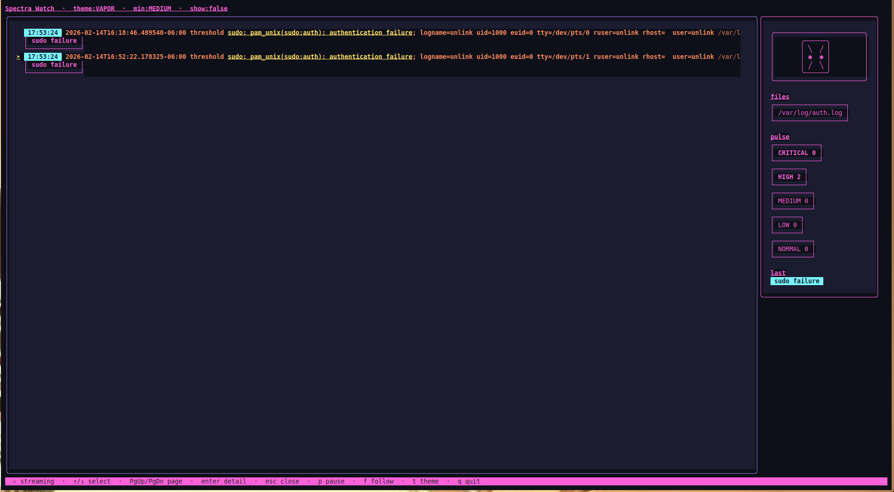

# Spectra Watch

Spectra Watch is a lush Bubble Tea / Lip Gloss terminal interface tailor-made for security-focused log watching. It tails multiple log files (Linux and macOS), runs every line through a modular regex ruleset, then paints the terminal with neon gradients, animated cues, and severity-driven accents—perfect for rice screenshots.

## Features

- 🚨 Regex-based rule engine with YAML configuration and capture groups
- 🌈 Multiple hand-tuned themes (`vapor`, `midnight`, `dusk`) with live switching (`t` key)
- 🪟 Split-pane layout: spacious log viewport, animated sidebar pulse, status ribbon
- 🎯 Focused feed that only displays rule hits by default (pass `--show-all` to stream every line)
- 📉 Severity floor via `--min-severity` so you can ignore low-priority chatter (default `medium`)
- 👁️ Animated ANSI “sentinel” eye in the header so you know the watcher is alive
- 🔦 Inline highlight fragments for matched substrings plus tag pills and rule badges
- 🪄 Smooth auto-follow with optional pause (`p`) and follow toggle (`f`)
- 🎛️ In-app configuration modal (`c`) to switch log files and rule bundles without restarting
- ♻️ Robust file tailer (`github.com/nxadm/tail`) that survives rotations/restarts

## Quick Start

```bash
# macOS with auto-detection
./watch /tmp/spectra-test.log

# Or explicitly specify files and config
./bin/spectra-watch --files=/var/log/system.log --config=configs/macos.rules.yaml

# Linux
./bin/spectra-watch --files=/var/log/auth.log,/var/log/syslog --config=configs/example.rules.yaml
```

**Note:** The `--files` flag is required. There is no default to ensure cross-platform compatibility.

Keys: `q` quit, `p` pause (freezes viewport but keeps collecting data), `f` toggle auto-follow, `t` cycle theme, `c` open the configuration modal.

Navigation: `↑`/`↓` move selection, `PgUp`/`PgDn` page through results, `Enter` opens the alert detail modal (press `Enter` or `Esc` again to dismiss).

Add `--show-all` to include every log line, and `--min-severity=high` (or similar) to dial-in the signal you want. Press `c` at any time to swap between curated log files (auth.log, syslog, sshd, etc.) and enable or disable rule groups based on tags.

### macOS Testing

The project includes macOS-specific rules and native unified logging support:

```bash
# EASIEST: Built-in macOS unified log streaming ⭐
./bin/spectra-watch --macos

# Or test with synthetic data first
./test_macos_logs.sh
./bin/spectra-watch --files=/tmp/spectra-test.log --config=configs/macos.rules.yaml

# Export unified log snapshot
log show --style syslog --last 1h > /tmp/macos-recent.log
./bin/spectra-watch --files=/tmp/macos-recent.log --config=configs/macos.rules.yaml
```

**The `--macos` flag automatically:**
- ✅ Streams unified log (includes sudo, auth, kernel, everything)
- ✅ Uses macOS rules config by default
- ✅ Cleans up temp files on exit
- ✅ No manual setup needed

See [SUDO_LOGGING.md](SUDO_LOGGING.md) for why unified logging is necessary.

The `macos.rules.yaml` config includes 53 patterns for:
- Open Directory authentication failures
- Keychain access violations
- Kernel panics and APFS errors
- Crash reporter events
- Sandbox violations
- Firewall blocks
- XPC service failures
- And more macOS-specific log patterns

### Configuration Modal

Tap `c` to surface a centered modal with two panes:

- **Log files** – curated presets (auth.log, secure, syslog, sshd) plus any custom paths you passed via `--files`. Toggle entries with `space`; unavailable files are dimmed.
- **Rule groups** – automatically generated from rule tags (ssh, sudo, kernel, cron…). leave everything unchecked to stream all rules, or cherry-pick subsets to focus alerts.

Use `tab` (or ←/→) to switch panes, `↑/↓` to move, `enter` to apply, and `esc` to close. Changes take effect immediately with no restart.

## Screenshots



## Rules Configuration

Rules live in YAML (`configs/example.rules.yaml`). Each rule supports:

```yaml
- name: ssh brute force
  pattern: 'Failed password for (?P<user>\S+) from (?P<ip>\d+\.\d+\.\d+\.\d+)'
  severity: critical   # critical|high|medium|low|normal
  color: "#FF5E5B"     # optional hex accent for future themes
  tags: [ssh, brute]   # inform sidebar badges and downstream hooks
```

Order matters; rules of the same severity trigger based on declaration order. Captured named groups are available for future alert hooks.

## Project Layout

- `cmd/watcher`: CLI wiring, flag parsing, graceful shutdown.
- `internal/watch`: resilient tailer per log file.
- `internal/rules`: YAML loader, compiler, and matcher.
- `internal/highlight`: splits matched indices into fragments for styling.
- `internal/pipeline`: links raw log events to highlighted events consumed by the UI.
- `internal/tui`: Bubble Tea model, layout, and theming.

## Development

- Standard Go workflow: `go build ./...`, `go test ./...` (after adding tests).
- Linting compatible with `golangci-lint`.
- Theme tweaks live in `internal/tui/theme.go`—use Lip Gloss to craft new palettes.

Enjoy painting your terminal like a synthwave SOC console! ✨
